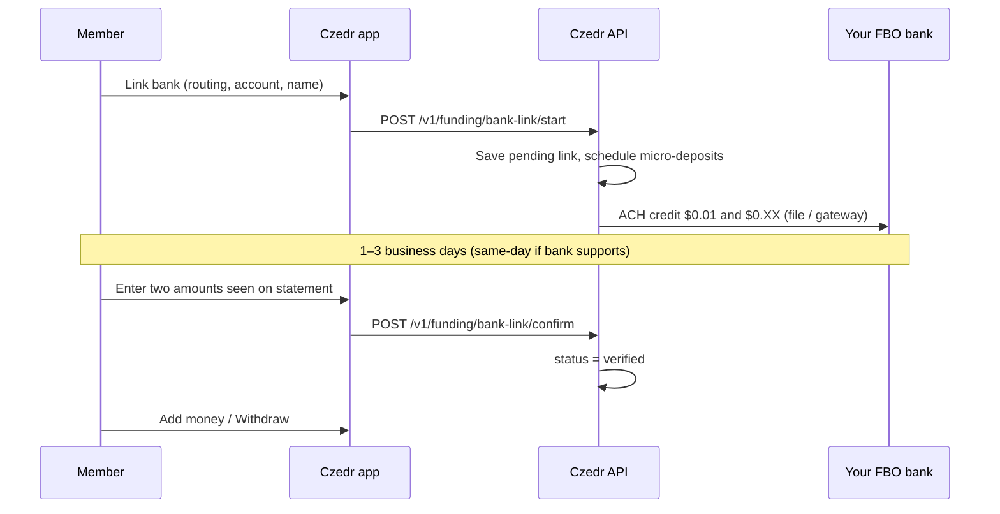

# Bank linking — micro-deposit only (no aggregators)

Czedr **never** uses Plaid, Yodlee, MX, Finicity, or any service that asks members for **online banking username and password**. Those products route credentials through a third party and recreate the risks you want to avoid.

Bank linking uses **micro-deposit verification** only: your platform sends two small ACH credits; the member proves ownership by entering the exact amounts.

**Linking a bank is optional.** Payments between Czedr members use the in-app ledger only (`docs/LEDGER-FIRST-BANK-OPTIONAL.md`). Deposits and withdrawals use the same verified link when you enable an ACH rail (`docs/MOOV-ACH-FUNDING.md`).

---

## Policy (non‑negotiable)

| Allowed | Not allowed |
|---------|-------------|
| Member types **routing + account** (and name on account) | Bank login screens |
| Two **ACH credits** from your settlement (FBO) account | Plaid / Yodlee / MX / “account aggregation” |
| Member confirms **two amounts** in the app | Storing or passing **passwords** |
| Encrypted storage of routing/account server-side | Screen scraping or credential vault vendors |

---

## User journey



---

## API

All routes require auth (Bearer / `auth_code`), same as other v1.

| Method | Path | Body | Result |
|--------|------|------|--------|
| `POST` | `/v1/funding/bank-link/start` | `routing_number`, `account_number`, `account_type` (`checking`/`savings`), `account_holder_name` | `{ bank_link_id, status: pending_micro_send, last4 }` |
| `POST` | `/v1/funding/bank-link/confirm` | `bank_link_id`, `amount_1_cents`, `amount_2_cents` | `{ status: verified }` or error |
| `GET` | `/v1/funding/banks` | — | List links (no full account numbers) |

Legacy Moov-named routes (`/v1/funding/moov/bank-link`) remain for compatibility but **must not** open hosted bank-login flows when `CZEDR_BANK_LINK_METHOD=microdeposit`.

---

## Status values (`bank_links` / `moov_bank_links`)

| Status | Meaning |
|--------|---------|
| `pending_micro_send` | Link saved; micro ACH not sent yet |
| `awaiting_confirm` | Two credits sent; waiting for member |
| `verified` | Amounts matched; OK for deposit/withdraw |
| `failed` | Too many wrong guesses or ACH returned |
| `revoked` | User removed link |

---

## Security

- **Encrypt** routing + account at rest (`account_vault` blob, AES-256-GCM + server pepper). App and logs never see full numbers after `start`.
- **Withdraw** only to a **verified** link; changing bank requires a new micro-deposit cycle.
- **Rate-limit** `confirm` (e.g. 5 attempts per link, then `failed`).
- **Cooling period** after verify before first withdraw (configurable).
- Display only **last 4** of account to the member.

---

## Sending the micro-deposits

Production: originate two **ACH credits** (SEC code appropriate for your program) from FBO to the member’s account via:

- [moov-io/ach](https://github.com/moov-io/ach) + [achgateway](https://github.com/moov-io/achgateway), or  
- [OpenACH](https://github.com/openach/openach), or  
- Your bank’s direct origination portal.

Until the file rail is wired, `ACH_FUNDING_ENABLED=0` or a cron/worker marks links `awaiting_confirm` after manual bank upload.

Local dev: `php scripts/simulate-microdeposit-sent.php --bank-link-id=<uuid>` then confirm amounts via API.

---

## Environment

```env
# Only supported bank-link mode today
CZEDR_BANK_LINK_METHOD=microdeposit

# Optional fixed amounts (defaults: random 1–99 cents each, must differ)
#CZEDR_MICRO_DEPOSIT_CENTS_A=1
#CZEDR_MICRO_DEPOSIT_CENTS_B=32

ACH_FUNDING_ENABLED=0
```

---

## iOS (planned)

1. **Link bank** — form: routing, account, name (no WebView login).  
2. **Waiting** — “Check your bank in 1–3 days for two small deposits from Czedr.”  
3. **Confirm** — two amount fields (cents or dollars).  
4. **Add funds / Withdraw** — only when `verified`.

---

## Related docs

- `docs/MOOV-ACH-FUNDING.md` — ledger credit on settled ACH deposit (no credential linking).  
- `database/migrations/014_bank_link_microdeposits.sql` — schema extensions + withdrawals table.
