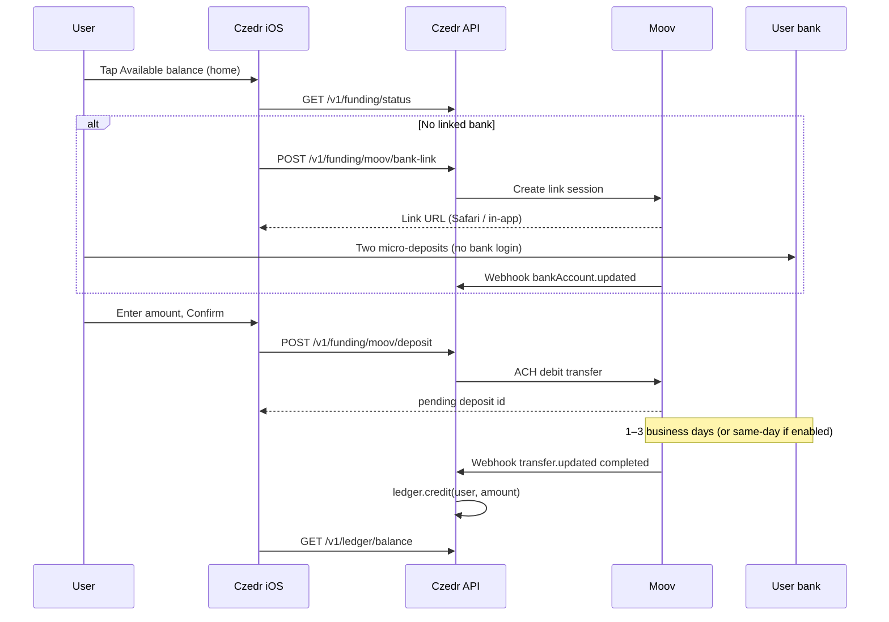

# Moov ACH funding — design for Czedr

Add real **bank → Czedr balance** funding on top of the existing **internal ledger**, without changing P2P transfers. Money only appears in `ledger_accounts` after the ACH debit **settles**.

**Bank linking:** Czedr does **not** use Plaid, Yodlee, MX, or any product that collects **online banking usernames/passwords**. Members link banks only via **micro-deposit verification** — see **`docs/BANK-LINK-MICRODEPOSITS.md`**.

---

## Principles

| Rule | Why |
|------|-----|
| Ledger credits **only on webhook `completed`** | Never trust the client or “transfer created” |
| Idempotency on every deposit | `idempotency_key` + unique `moov_transfer_id` |
| Moov secrets **server-only** | iOS never sees `MOOV_SECRET_KEY` |
| Feature-flagged | `MOOV_ENABLED=1` + credentials; otherwise API returns `503` |
| HTTPS in production | Moov webhooks require a public TLS URL |

---

## User journey (iOS)



### Where it lives in the app

| Location | Action |
|----------|--------|
| **Home** (`leftSwipeViewController`) | Tap **Available balance** → `AddFundsViewController` (implemented as stub; wire when Moov credentials exist) |
| **Profile** (optional phase 2) | “Linked bank” + “Add money” duplicate entry |
| **History** (phase 2) | Show ACH deposits with status `pending` / `completed` / `failed` |

Do **not** reuse **Add card** (`addCreditViewController`) — that flow is encrypted card metadata, not ACH.

---

## API surface

All routes except the webhook require Bearer / `auth_code` (same as other v1).

| Method | Path | Purpose |
|--------|------|---------|
| `GET` | `/v1/funding/status` | `{ enabled, moov_ready, banks[], pending_deposits[] }` |
| `POST` | `/v1/funding/moov/onboarding` | Ensure Moov **account** exists for user; return `moov_account_id` |
| `POST` | `/v1/funding/bank-link/start` | Micro-deposit link (routing + account; **no password**) |
| `POST` | `/v1/funding/bank-link/confirm` | Confirm two deposit amounts |
| `POST` | `/v1/funding/moov/bank-link` | **Disabled** — returns error; do not use hosted bank login |
| `GET` | `/v1/funding/moov/banks` | Linked banks: `id`, `last4`, `name`, `is_default` |
| `POST` | `/v1/funding/moov/deposit` | Body: `amount_cents`, `bank_account_id?`, `idempotency_key` → `{ deposit_id, status: pending }` |
| `GET` | `/v1/funding/moov/deposits` | List user deposits (for history UI) |
| `POST` | `/v1/webhooks/moov` | **No auth** — verify `X-Signature` / Moov signing secret |

When `MOOV_ENABLED` is off or credentials missing → **`503`** with `{ "message": "ACH funding is not configured" }`.

---

## Moov integration (server)

### 1. Moov Dashboard setup

1. Create a [Moov](https://moov.io) account (sandbox first).
2. **Developers → API keys** — `MOOV_PUBLIC_KEY`, `MOOV_SECRET_KEY` (server).
3. **Developers → Webhooks** — point to `https://api.yourdomain.com/v1/webhooks/moov`, subscribe to:
   - `transfer.created`, `transfer.updated`
   - `bankAccount.created`, `bankAccount.updated` (if using bank link events)
4. Note your **platform account ID** and **wallet ID** (ACH settlement destination before ledger credit).

Docs: [ACH transfers](https://docs.moov.io/guides/money-movement/accept-payments/ach/), [Webhooks](https://docs.moov.io/guides/webhooks/set-up-webhooks/).

### 2. Per-user Moov account

On first funding attempt:

```
POST https://api.moov.io/accounts
Authorization: Basic (secret)
{ "profile": { "individual": { "name": { ... }, "email": ... } }, "metadata": { "czedr_user_id": "<uuid>" } }
```

Store `moov_account_id` in `moov_accounts` (see migration `013_moov_ach.sql`).

### 3. Link bank account

Preferred: **Moov Drops** or hosted bank-link flow so Czedr never stores routing/account numbers.

```
POST .../accounts/{moovAccountID}/bank-accounts   (or Drops session URL from Moov)
```

Persist `moov_bank_account_id`, `last_four`, `bank_name`, `status` in `moov_bank_links`.

### 4. ACH debit (add money)

```
POST .../transfers
{
  "source": { "bankAccountID": "<linked>" },
  "destination": { "walletID": "<MOOV_WALLET_ID>" },
  "amount": { "currency": "USD", "value": 5000 },
  "description": "Czedr balance load"
}
```

Insert `ach_deposits` row: `status=pending`, `moov_transfer_id`, `idempotency_key`.

### 5. Webhook → ledger credit

On `transfer.updated` with status **`completed`** (verify signature first):

1. Find `ach_deposits` by `moov_transfer_id`.
2. If already `completed`, return 200 (idempotent).
3. Else `LedgerService::credit($userId, amount_cents, "moov-ach:{transferId}", "ACH deposit")`.
4. Set deposit `status=completed`, store `ledger_txn_id`.

On **`failed`** / **`reversed`**: set deposit status; **do not** credit ledger.

Respond within **5 seconds**; queue heavy work if needed.

---

## Database (`013_moov_ach.sql`)

| Table | Role |
|-------|------|
| `moov_accounts` | `user_id` ↔ `moov_account_id` |
| `moov_bank_links` | Linked banks per user |
| `ach_deposits` | Each add-money attempt + link to ledger |

---

## Environment variables

Add to `.env` (see `.env.example`):

```env
MOOV_ENABLED=0
MOOV_BASE_URL=https://api.moov.io
MOOV_PUBLIC_KEY=
MOOV_SECRET_KEY=
MOOV_PLATFORM_ACCOUNT_ID=
MOOV_WALLET_ID=
MOOV_WEBHOOK_SECRET=
```

Sandbox URL may differ; check Moov docs for your environment.

---

## Security checklist

- [ ] Webhook signature verification on every `POST /v1/webhooks/moov`
- [ ] Rate-limit `POST /v1/funding/moov/deposit` (per user + IP)
- [ ] Min/max deposit amounts (`CZEDR_ACH_MIN_CENTS`, `CZEDR_ACH_MAX_CENTS`)
- [ ] Production `APP_ENV=production` + HTTPS (`docs/DEPLOY-HTTPS.md`)
- [ ] Reconcile nightly: Moov transfer report vs `ach_deposits` + ledger entries

---

## Local testing (no Moov account yet)

1. API returns `503` on funding routes until `MOOV_ENABLED=1` and keys are set.
2. Simulate webhook after manual DB insert:

```bash
php scripts/test-moov-deposit-webhook.php --deposit-id=<uuid> --status=completed
```

3. Continue using `scripts/fund-test-accounts.ps1` for ledger-only dev.

---

## Implementation status in repo

| Piece | Status |
|-------|--------|
| This doc | Done |
| Migration `013_moov_ach.sql` | Done |
| `MoovConfig`, `MoovHttpClient`, `MoovAchService` | Scaffold (throws until configured) |
| v1 funding routes + webhook route | Scaffold |
| iOS `AddFundsViewController` + balance tap | Stub UI |
| `SharedServiceController` funding helpers | Stub |
| Live Moov API calls | **Not wired** — fill in `MoovHttpClient` when keys exist |

---

## Phased rollout

1. **Phase A** — Backend + webhook + sandbox keys; test with curl and simulated webhooks.
2. **Phase B** — iOS Add Funds screen + bank link in Safari.
3. **Phase C** — Production Moov, HTTPS, limits, support runbook.
4. **Phase D** (optional) — ACH **withdraw** (balance → bank) as mirror flow.
